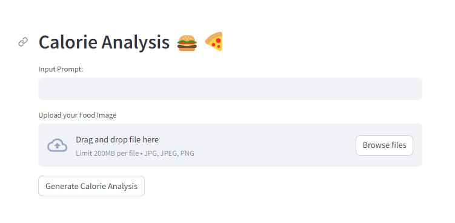
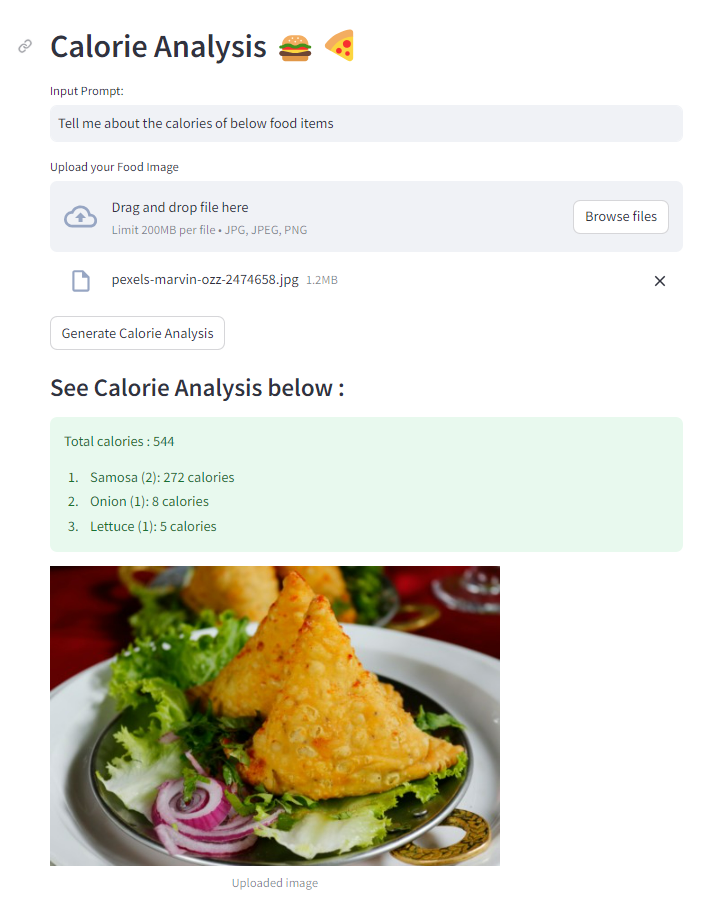
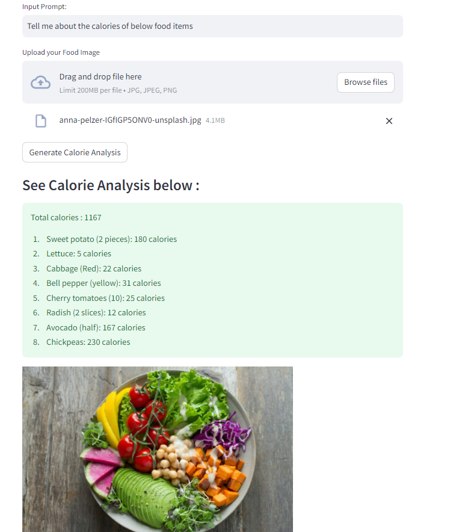
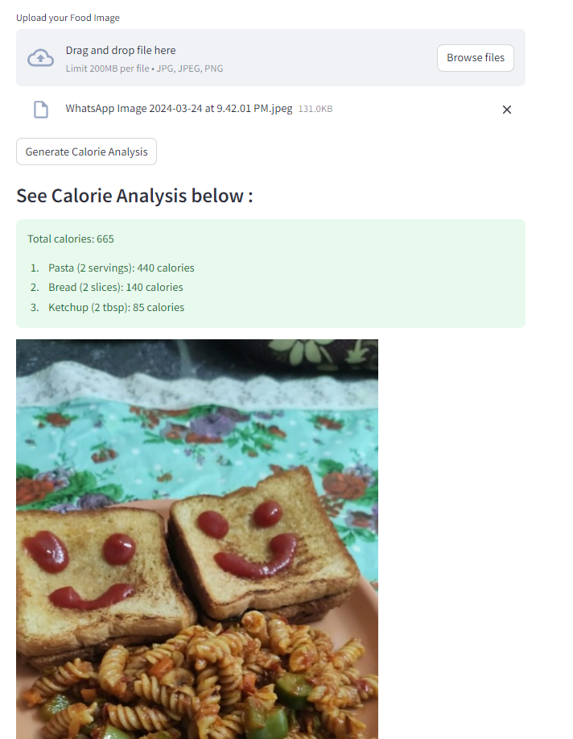
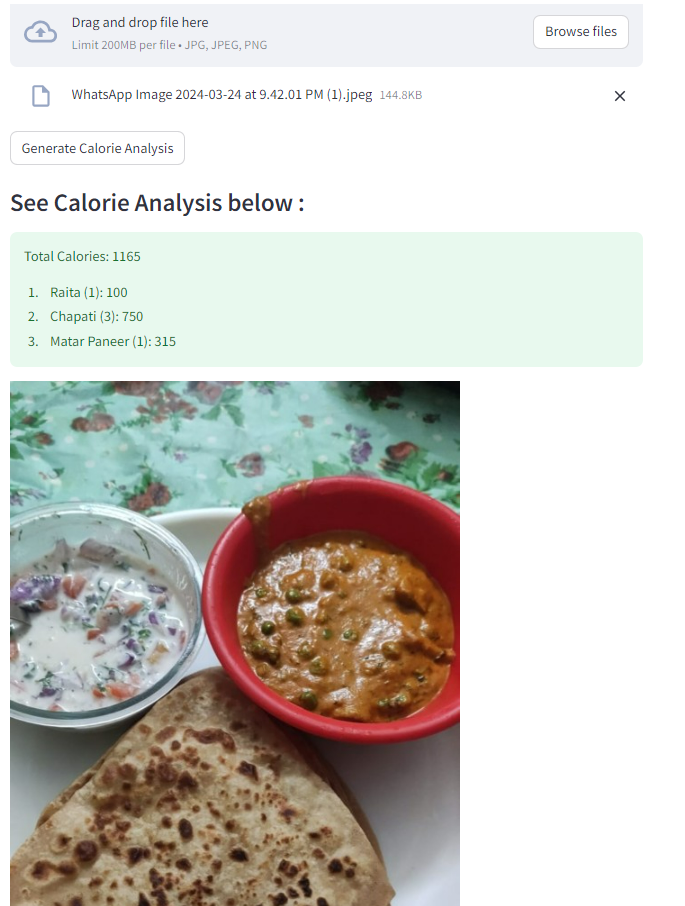

# Gemini-pro-Calorie-Analysis

In this project we will be using Gemini pro vision to analyze the input food image and calculate the total calories along with each calorie count for separate food items.

## Deployed Link

[Link](https://huggingface.co/spaces/SBairagi/Gemini-pro-Calorie-Analysis)

Below are some exampples as to how this model performs for different food items.

